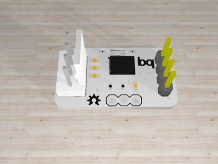

# BNO055
#### 9DOF Absolute orientation sensor

&nbsp;

This repository contains the sensor board and a library for arduino. Both the board and the library are still under development and susceptible of improvement :)

#### BOARD

·The sensor works at 3.3V and can be used through UART or I2C by soldering the PS0 and PS1 pads below, as per the table below:

| PS1        | PS0           | Functionality  |
| ------------- |:-------------:| -----:|
| 0 | 0 | Standard/Fast I2C Interface|
| 0 | 1 |   HID over I2C |
| 1 | 0 |    UART Interface |
| 1 | 1 |    Reserved |

In order to be used with a 5V level microcontroller a 5V-3.3V level shifter must be used.

&nbsp;
·It has two possible, hardware-defined I2C addresses, which are selectable through a solder pad, as in the following table:

| ID PAD       | I2C Address           | ID  |
| ------------- |:-------------:| -----:|
| Not soldered | 0x28 | A |
| Soldered | 0x29 | B  |

&nbsp;

·The "I2C" pad enables the sensor's 4.7k pullup resistors. This pad should only be soldered if there were no other pullup resistors on the bus.

&nbsp;

#### LIBRARY

· To install the library simply copy the folder "BNO055" into your folder "sketchbook/libraries/".

&nbsp;
· In the "examples" subfolder a cheatsheet sketch is available which demonstrates how to read different data.